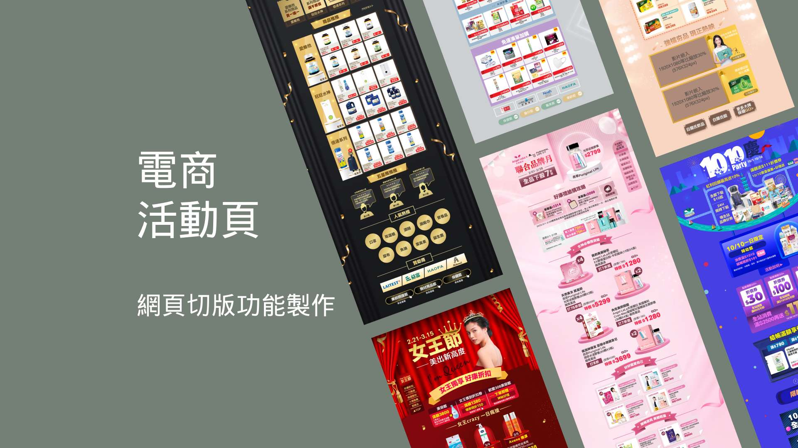

# 電商活動頁網站

## 專案簡介

本專案為一個 **行銷活動頁** 前端網站，應用於電商促銷期間的視覺展示與互動體驗。使用 **JavaScript + jQuery + SCSS** 技術實作，具備 RWD 響應式設計與豐富動畫特效，適用於單頁式促銷活動、主打商品、限時優惠頁面等。

## Demo 連結

<a href="https://chinyishan.github.io/website-mall-event/">網站連結</a>

## 使用技術

- 動畫特效：使用 CSS3 / jQuery 實現滑入、淡入、滾動觸發效果。
- RWD 響應式設計：支援桌機、平板、手機等各尺寸裝置。
- 模組化 SCSS：樣式結構清晰，易於維護與擴充。
- 原生 JS + jQuery 控制互動邏輯，如倒數計時、彈窗、Tab 切換等。
- 可快速嵌入至任意 CMS 或活動主站
